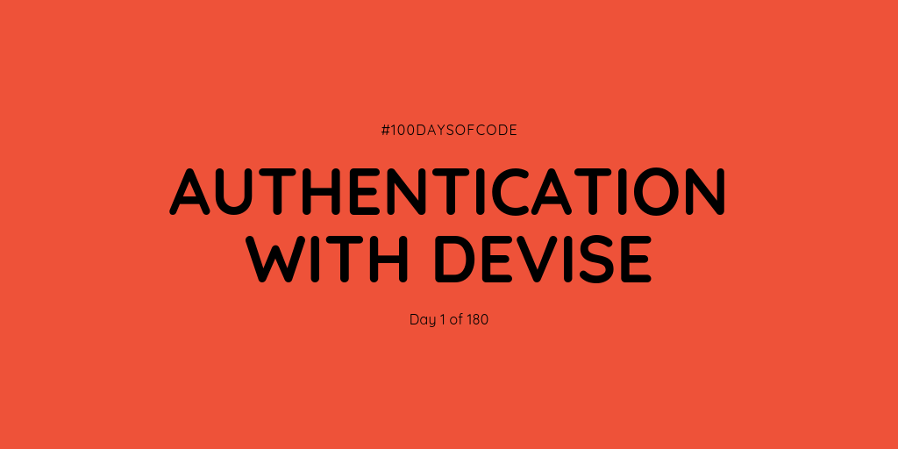

Okay, so now that I am officially a NEET what better way to spend my time than by doing #100DaysOfCode challenge. Also, since I'm planning on being like this for 6 months why not make it 180 instead of just 100? It will also be fun to count the pomodoro sessions that I've finished. A proof of it will be added on YouTube. It will also be streamed so that I can have content on both YouTube and Twitch at the same time!

For day 1 I'm doing Rails authentication using the gem called Devise. I made it work! I've actually been eyeing this for quite a while now since it seems like the easiest way to make an authentication. What's funny is that on the documentation from GitHub about Devise, it says that I need to learn basic authentication first but it seems like Devise is simple enough for me to understand. They did a great job with this gem and I really really like it. I guess now I have an authentication for the apps that I'll build. Real nice.

As for tomorrow I'm thinking studying the model aspect of Rails more seriously. I'm getting excited!

**Repository:** https://github.com/kuru-project/top-10-waifu  
**Pomodoro Sessions:** 2  
**Programming Languages Used:** Ruby  
**Frameworks / Libraries / Gems:** Rails, Devise  
**Twitch Link:** https://www.twitch.tv/bosericode  
**YouTube Video Link:** https://www.youtube.com/watch?v=JQ2FiwQjkoo  
**Stream Time Elapsed:** 56:28

