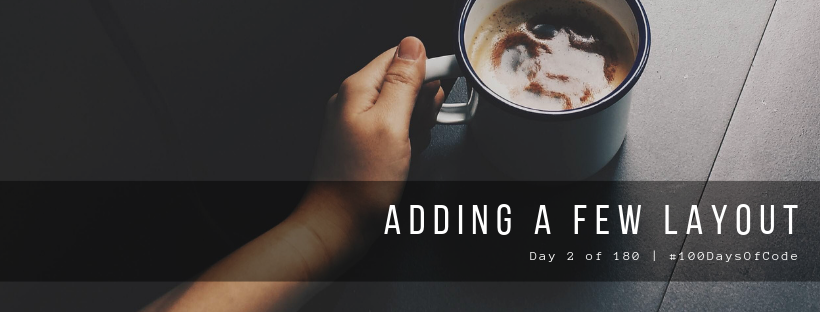

Okay. I know this one is short but we have visitors and I can't focus properly. Neverthless, I still wanted to make a progress today even for a little bit. I promise I'll make the upcoming days more longer. I'll aim for minimum of 5 pomodoro sessions a day.

As for what I did today, I did what I'm good at and that's adding a few styles. Might not be the best site you'll see but there's better experience on this one. Tomorrow I'll add the second model so look forward to it!

**Repository:** https://github.com/kuru-project/top-10-waifu  
**Pomodoro Sessions:** 1  
**Programming Languages Used:** Ruby  
**Frameworks / Libraries / Gems:** Rails, Devise  
**Twitch Link:** https://www.twitch.tv/bosericode  
**YouTube Video Link:** https://www.youtube.com/watch?v=4GjEHTfiAwc  
**Stream Time Elapsed:** 25:59

