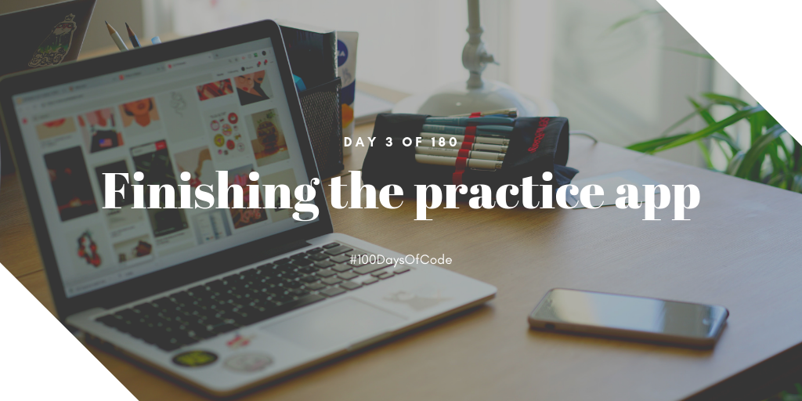

I've finished the app that I'm making for testing purposes of the gem called Devise! I unfortunately haven't had the chance of streaming it since the internet is acting really strange today. Nevertheless, I still did continue with my third day of the challenge. I'm loving Rails more now! Who needs configuration when you have Ruby on Rails? Haha!

**Repository:** https://github.com/kuru-project/top-10-waifu  
**Pomodoro Sessions:** N/A  
**Programming Languages Used:** Ruby  
**Frameworks / Libraries / Gems:** Rails  
**Twitch Link:** https://www.twitch.tv/bosericode  
**YouTube Video Link:** N/A  
**Stream Time Elapsed:** N/A

