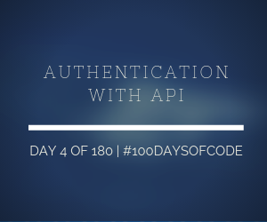

I managed to make an authentication using tokens! This is cool! I'm getting closer and closer to what I wanted to make for Kuru Anime! I'll try to make a proper namespace tomorrow on my routes (using resources). This will be fun! Then on Day 6 I'll do GraphQL! I can't believe I'll be having this much fun using Ruby on Rails!

**Repository:** https://github.com/kuru-project/top-10-anime  
**Pomodoro Sessions:** 4  
**Programming Languages Used:** Ruby  
**Frameworks / Libraries / Gems:** Rails, Docker, jwt, bcrypt, simple_command  
**Twitch Link:** https://www.twitch.tv/bosericode  
**YouTube Video Link:** https://www.youtube.com/watch?v=9BjItRzKJDU  
**Stream Time Elapsed:** 1:52:32