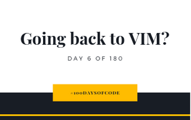

So I was going to try and learn more thing about authentication on Rails API but now I want to do something else for a bit. I want to go back to using VIM! I've actually been thinking about this for a while now since the VSCode VIM extension is giving me a hard time on the explorer. Sometimes the navigation on the explorer just doesn't work and now I miss my VIM navigation.

Anyway, what made me want to move back now? It's because I saw this electron-based terminal called Hyper. Yep! You read that right. An electron-based terminal! Ain't that something? It looks really really cool in my opinion. So what better time to move back to VIM than now? I also want to learn more about bash automation and such so I think it really is a great time to move back to VIM.

I'm not sure when I'll be back to Rails but since I have all the time that I can have right now then moving to VIM won't be that long. Probably less than a week with all the bash automation that I want to learn. It's going to be fun!

**Repository:** https://github.com/kuru-project/top-10-anime  
**Pomodoro Sessions:** 1  
**Programming Languages Used:** Ruby  
**Frameworks / Libraries / Gems:** Rails  
**Twitch Link:** https://www.twitch.tv/bosericode  
**YouTube Video Link:** https://www.youtube.com/watch?v=kL3YS2B5j_M  
**Stream Time Elapsed:** 25:03