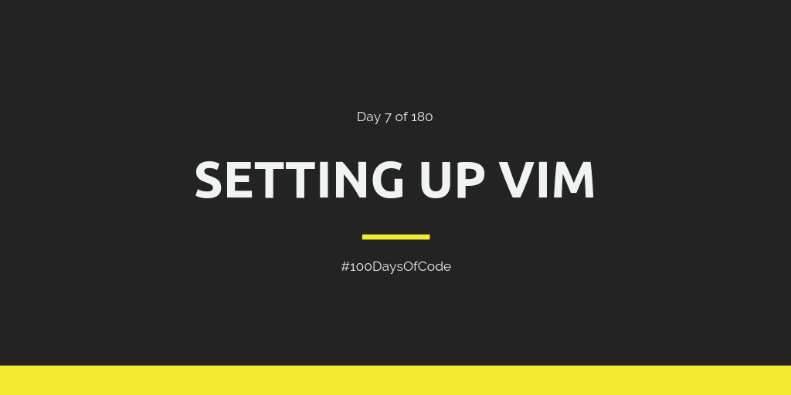

I'm getting excited again! I love working on my development tools. It's one of the most exciting things for me. I just love it. I'm just scratching the surface here, to be honest. I still have lots of things to set up! For today I just set up Vundle. Tomorrow I'll work on adding Tmux!

**Repository:** https://github.com/BosEriko/dotfiles  
**Pomodoro Sessions:** 2  
**Programming Languages Used:** N/A  
**Frameworks / Libraries / Gems:** N/A  
**Twitch Link:** https://www.twitch.tv/bosericode  
**YouTube Video Link:** https://www.youtube.com/watch?v=X6wMoGyM81c  
**Stream Time Elapsed:** 54:48