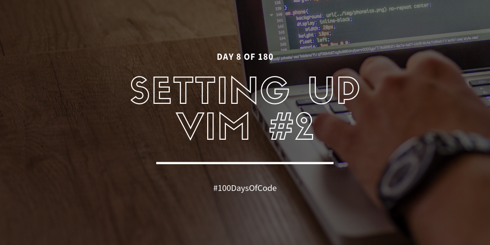

Okay. This is the second day I'm working on my Vim editor and it's taking longer than I expected it to be, but it's fine. I'm enjoying it! I've already installed Tmux and I've set it so that Tmux will automatically open when a zsh shell has been opened. I think that's really convenient. There are still a lot of things I need to work on so that I can be productive again. I have so many ideas that I want to add! I also need to know how to add versions for my Git repository so that I can easily go back to my VSCode settings if I want to. For emergency purposes.

**Repository:** https://github.com/BosEriko/dotfiles  
**Pomodoro Sessions:** 2  
**Programming Languages Used:** N/A  
**Frameworks / Libraries / Gems:** N/A  
**Twitch Link:** https://www.twitch.tv/bosericode  
**YouTube Video Link:** https://www.youtube.com/watch?v=RsEwVQU2rZE  
**Stream Time Elapsed:** 1:14:36
