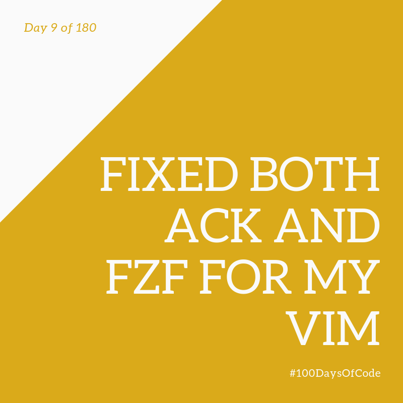

Goodbye, VSCode! Hello again, Vim! Okay! I've finally finished moving back to Vim! Why did I move, though? I don't know. I just felt like it. Well, my only problem before with Vim was the fuzzy finder but I managed to fix it here on my Mac so now everything's cool again! Hackerman time! I also made versions on my online repositories. Real nice.

**Repository:** https://github.com/BosEriko/dotfiles  
**Pomodoro Sessions:** 2  
**Programming Languages Used:** N/A  
**Frameworks / Libraries / Gems:** N/A  
**Twitch Link:** https://www.twitch.tv/bosericode  
**YouTube Video Link:** https://www.youtube.com/watch?v=ugNK8ytbZZw  
**Stream Time Elapsed:** 50:37
