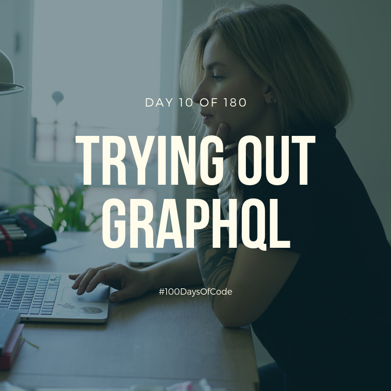

Okay. I was going to try GraphQL but then I thought I should just try everything on the Kuru Anime Server repository instead of just testing it with random repositories. I think it's much better to also have an approach of code refactoring instead of just redoing everything over and over again on different repositories. So I stopped testing GraphQL now and tomorrow I'll probably move on to my main project. It's going to be fun!

**Repository:** N/A  
**Pomodoro Sessions:** 1  
**Programming Languages Used:** Ruby  
**Frameworks / Libraries / Gems:** GraphQL, Rails, Docker  
**Twitch Link:** https://www.twitch.tv/bosericode  
**YouTube Video Link:** https://www.youtube.com/watch?v=PXBlnjvlJHg  
**Stream Time Elapsed:** 42:28
